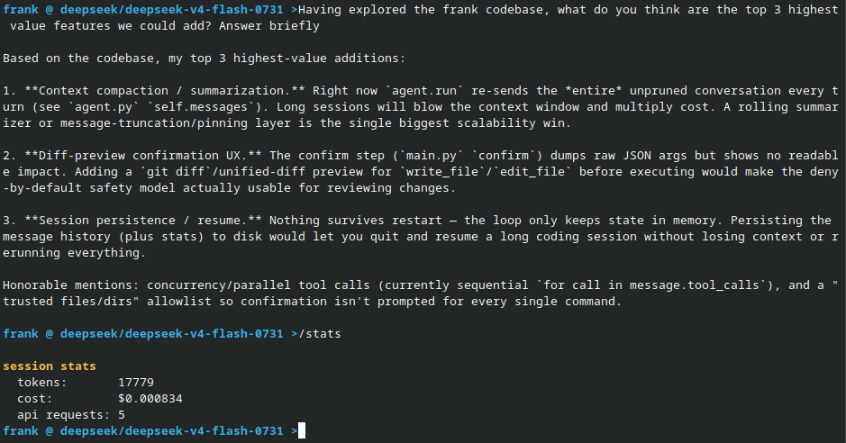

# Frank

A minimal coding agent harness that runs in your terminal. It talks to any
OpenAI-compatible model — a remote one through
[OpenRouter](https://openrouter.ai), or a local one running
[llama.cpp](https://github.com/ggerganov/llama.cpp) — via the standard
`openai` library. It inspects and edits code, runs shell commands, and keeps a
running tally of tokens — all through a simple REPL with a
deny-by-default confirmation prompt before every tool call.



## Install

```sh
uv sync
```

## Setup

Copy the example env file and configure a provider:

```sh
cp .env.example .env
```

`.env.example` documents every option. The two supported providers:

**OpenRouter (remote)** — set your key and pick it (the default):

```sh
FRANK_PROVIDER=openrouter
OPENROUTER_API_KEY=sk-or-...
```

**llama.cpp (local)** — start a server and point at it:

```sh
# from a directory that has your model
llama-server -m model.gguf --port 8080
```

```sh
FRANK_PROVIDER=llama
LLAMA_CPP_BASE_URL=http://localhost:8080/v1
LLAMA_CPP_MODEL=model.gguf
```

(`LLAMA_CPP_BASE_URL` defaults to `http://localhost:8080/v1`; the `openai`
library expects the `/v1` prefix in front of `/chat/completions`.)

## Run

```sh
uv run python main.py
```

Override the provider or model on the command line:

```sh
uv run python main.py --provider llama --model model.gguf
```

### REPL commands

| Command | Description |
| --- | --- |
| `/model <name>` | Switch models (OpenRouter slug or local model name) |
| `/stats` | Show provider, session tokens, and API request count |
| `/debug` | Toggle debug output |
| `/quit` | Exit |

Type anything else to send it to the model. Every tool call asks for
confirmation before running; deny to skip.

## Providers

Frank talks to models through a small, SDK-agnostic contract in
[`providers.py`](providers.py). Every provider speaks the same language — it
takes a model id + messages + tool schemas and returns a `ChatResponse` — and
all of them are backed by the standard `openai` library against the OpenAI-
compatible `/chat/completions` endpoint. Adding a new backend means dropping in
one more provider class; the agent loop never changes.

## How it works

The agent sends the whole conversation to the model. If it replies with tool
calls, they're confirmed and executed, the results are appended, and the loop
repeats. When the model replies with plain text, the turn ends and control
returns to the REPL.
